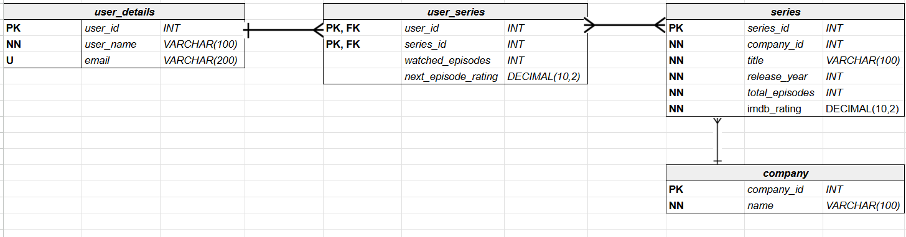

<div align="center">

# 📺 TV Tracker

A MySQL database project designed to help users track, manage, and rank TV shows based on viewing progress, ratings, and preferences.  
This system replaces manual tracking methods with an automated, queryable, and reliable database solution.

[](https://www.mysql.com/)
[](./img/ERD.png)
[](LICENSE.txt)

</div>


## 📌 Overview
TV Tracker stores detailed user profiles, TV series metadata, ratings, and progress information.  
It also calculates personalized ranking scores using a custom formula, ensuring users always know what to watch next.


## ✨ Features

### Current Features
<div align="left">

- **User Profiles** – Store and manage user details and viewing habits.
- **Series Metadata** – Track title, genre, total episodes, production details, and more.
- **External & User Ratings** – Combine IMDb ratings with user-provided next-episode ratings.
- **Personalized Ranking** – Automatically calculate scores using:

  ```
  ((watched_episodes / total_episodes) * 100) + (imdb_rating * 10) + (next_episode_rating * 10) ) / 3
  ```
  
- **Views** – `user_series_ranking_view` displays series in descending order of score.
- **Triggers** – `trg_update_series_rating` sets next episode rating to `0` when a show is completed.
- **Functions** – `fn_get_series_score` returns a score for a given user and series.

</div>


### 🚀 Potential Future Features
<div align="left">

- **Social Sharing** – Share rankings and watchlists with friends or fan communities.
- **Automated Data Updates** – Integrate APIs to refresh show details, episode counts, and ratings.
- **Recommendations** – Suggest new series based on a user’s watch history and scores.
- **Mobile/Web Access** – Make the database accessible through a user-friendly app or site.

</div>


## 🛠 Database Structure

- **Tables**  
  - `user_details` – Stores user information.  
  - `series` – Holds TV series metadata.  
  - `company` – Stores production company details.  
  - `user_series` – Tracks user’s watched episodes and ratings.

- **Relationships**  
  - `user_details` ↔ `user_series` ↔ `series` ↔ `company`


## 📊 Entity Relationship Diagram



## ⚙️ Tools Used
- **MySQL** – Database engine
- **SQL Views, Functions, Triggers** – Data processing and automation


## 📈 Benefits
- Prevents losing track of watched episodes.
- Eliminates inconsistent data for completed series.
- Creates a unified ranking score from multiple factors.
- Improves data accessibility for analysis and recommendations.


## 🧠 Lessons Learned
- Importance of normalizing tables for scalability.
- The value of triggers in maintaining data integrity.
- Balancing personalization with fair ranking algorithms.


## 📜 License

This project is licensed under the **MIT License** – see the [LICENSE](LICENSE.txt) file for details.